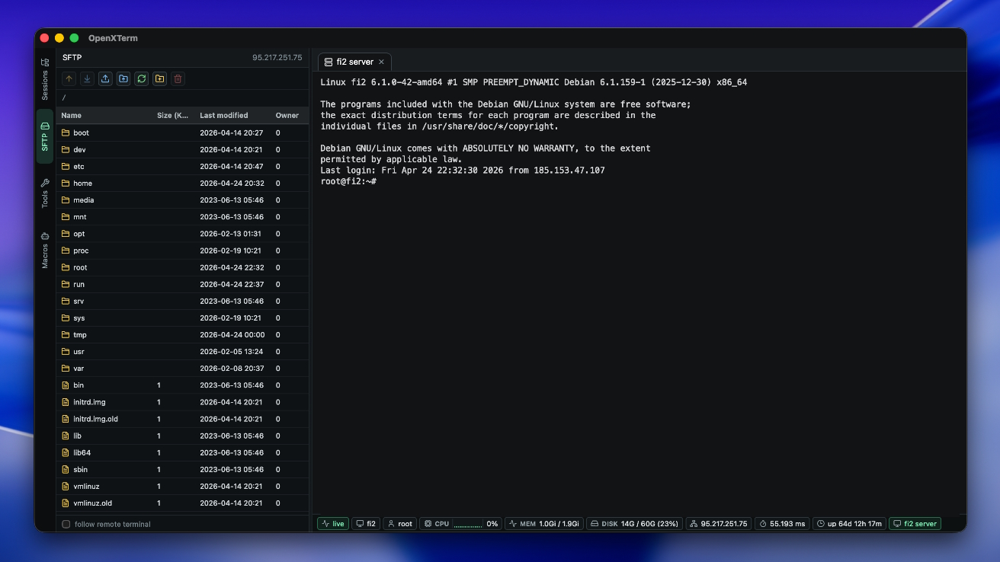

<p align="center">
  
</p>

<h1 align="center">OpenXTerm</h1>

<p align="center">
  Open-source desktop terminal workspace for saved sessions, SSH, SFTP, local shells, file transfers, macros, and live host status.
</p>

<p align="center">
  <a href="https://github.com/OpenXTerm/OpenXTerm/actions/workflows/ci-cd.yml"></a>
  <a href="LICENSE"></a>
  
  
  
  
</p>

<p align="center">
  
</p>

## What Is OpenXTerm?

OpenXTerm is a Tauri 2 desktop application that brings a session-first terminal workflow to macOS, Linux, and Windows.

It is built for people who want saved connections, folders, terminal tabs, linked SFTP, file transfers, macros, and live status in one compact workspace.

The project is inspired by the workflow popularized by MobaXterm, but OpenXTerm is independent software and is not affiliated with, endorsed by, or connected to MobaXterm or Mobatek.

## Current Status

OpenXTerm is alpha software. It is usable for development and testing, but APIs, storage shape, UI details, and packaging behavior may still change before a stable release.

Downloads are not treated as stable releases yet. Until signing, notarization, and update channels are finished, use GitHub Actions artifacts or build locally from source.

Current focus areas:

- reliable SSH, Telnet, Serial, and local terminal sessions
- linked SFTP workflows for live SSH sessions
- Windows, macOS, and Linux packaging
- native drag-out and transfer reliability
- embedded SSH helper behavior
- X11 forwarding diagnostics
- UI simplification and density

## Platform Status

| Platform | Build | Notes |
| --- | --- | --- |
| Windows x64 | CI bundle | Primary active test target. |
| Windows ARM64 | CI bundle | Build target exists; needs more device QA. |
| macOS ARM64 | CI bundle | Unsigned and unnotarized. |
| macOS x64 | CI bundle | Unsigned and unnotarized. |
| Linux x64 | CI bundle | Requires normal Tauri/WebKit runtime packages. |

## Features

- Saved session profiles for Local, SSH, Telnet, Serial, SFTP, and FTP-shaped workflows.
- Session folders with tree organization and sidebar drag/drop.
- Multiple simultaneous tabs for the same saved session.
- Embedded `libssh-rs` SSH runtime for live SSH terminal tabs.
- Linked SFTP discovery from active SSH tabs.
- Remote file listing, folder creation, rename, delete, upload, download, and native drag-out.
- Batch transfer aggregation for multi-file operations.
- Per-session terminal appearance: font family, font size, foreground, and background.
- System font picker for terminal profiles.
- Terminal search, clear, reset, restart, and save-output flows.
- Live lower status bar with host, user, uptime, CPU history, memory, disk, network, and latency when available.
- MobaXterm `.mxtsessions` import for common session types.
- Optional app lock through platform authentication where supported.
- Embedded SSH X11 forwarding bridge and runtime diagnostics.
- Error-only frontend console logging for operational failures.
- GitHub Actions builds for Linux X64, Windows X64, Windows ARM64, macOS ARM64, and macOS X64.

## Quick Start

Install dependencies:

```bash
npm install
```

Run the desktop app:

```bash
npm run tauri:dev
```

Build the desktop app:

```bash
npm run tauri:build
```

Typecheck and lint:

```bash
npm run check
```

Build the Rust backend directly:

```bash
cargo build --manifest-path src-tauri/Cargo.toml
```

### Windows Build Note

The embedded SSH runtime builds vendored OpenSSL through `libssh-rs`, which needs a full Perl installation on Windows.

The npm Tauri scripts run through [`script/run_tauri.mjs`](script/run_tauri.mjs). That wrapper checks for Perl before Cargo starts and prints install guidance if Perl is missing.

Recommended Windows install:

```powershell
winget install StrawberryPerl.StrawberryPerl
```

After installing Strawberry Perl, open a fresh terminal so `perl.exe` is visible in `PATH`.

## Security Note

OpenXTerm is still alpha. Treat saved credentials and imported session data accordingly. Platform credential-store integration and release signing are not finished yet.

## Development

Useful commands:

```bash
npm run check
cargo check --manifest-path src-tauri/Cargo.toml
cargo build --manifest-path src-tauri/Cargo.toml
```

On Unix-like systems, the helper script can start or verify the app:

```bash
./script/build_and_run.sh
./script/build_and_run.sh --verify
```

Fresh contributors and coding agents should read [`AGENTS.md`](AGENTS.md). It documents current architecture, invariants, known fragile areas, and recommended edit points.

## Project Structure

```text
OpenXTerm/
  src/
    components/
      forms/
      layout/
      sidebar/
      status/
      workspace/
    lib/
    state/
    types/
  src-tauri/
    src/
      commands.rs
      file_ops.rs
      font_support.rs
      libssh_spike.rs
      models.rs
      native_drag.rs
      native_menu.rs
      runtime.rs
      storage.rs
      system_auth.rs
      x11_support.rs
  docs/
    architecture/
    qa/
  script/
```

## CI/CD

The GitHub Actions workflow lives at [`.github/workflows/ci-cd.yml`](.github/workflows/ci-cd.yml).

It currently runs verification and bundle builds for:

- Linux X64
- Windows X64
- Windows ARM64
- macOS ARM64
- macOS X64

CI/CD is manual-only: run the workflow from GitHub Actions with a release `version` and choose `release` or `prerelease`. The workflow creates the release commit and tag, publishes bundle assets, and generates release notes from the previous version tag. Current release assets are unsigned and unnotarized until signing secrets are added.

## Roadmap

See [ROADMAP.md](ROADMAP.md) for the active release plan, stable-release blockers, and feature status.

## FAQ

**Is OpenXTerm a MobaXterm clone?**
No. It is an independent open-source terminal workspace inspired by session-first tools. The goal is a focused cross-platform workflow, not a complete feature-for-feature clone.

**Where are stable installers?**
Not yet published. CI builds bundles for all target platforms, but release signing and notarization are still pending.

**Can I contribute?**
Yes. Start with [CONTRIBUTING.md](CONTRIBUTING.md), [AGENTS.md](AGENTS.md), and [ROADMAP.md](ROADMAP.md).

## Known Limits

- OpenXTerm is not a finished MobaXterm clone. It covers a focused subset and is evolving quickly.
- X11 forwarding requires a working local X server: XQuartz on macOS, Xorg/XWayland on Linux, or a Windows X server such as VcXsrv or X410.
- Remote status metrics are best-effort and depend on the remote OS and available shell tools.
- Linked SFTP and live status can reuse an interactively entered SSH password only while the originating SSH tab is still connected.
- Packaging, signing, notarization, and update channels still need a dedicated release pass.
- There is no broad automated test suite yet. Manual QA remains important for terminal IO, native drag, and cross-platform packaging.

## Trademark Notice

OpenXTerm is independent software and is not affiliated with, endorsed by, sponsored by, or connected to Mobatek or MobaXterm.

MobaXterm belongs to Mobatek:

> © 2008 - 2026 Mobatek. MobaXterm® is a registered trademark of Mobatek.

## License

MIT. See [LICENSE](LICENSE).
